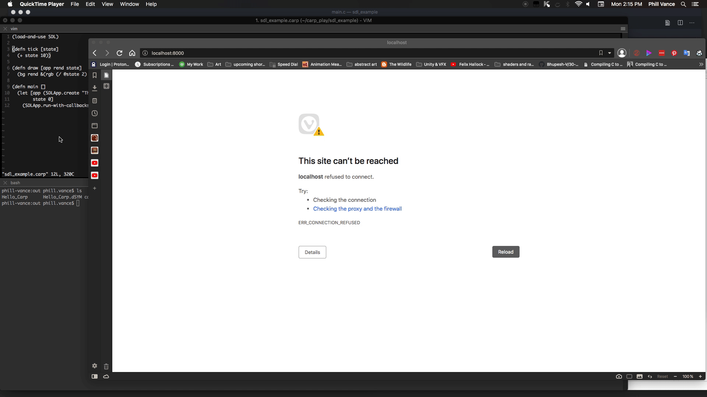

# Carp Very Simple Example Wasm
It is trivial to compile simple Carp programs like Hello world to Wasm, but here I compile a small SDL2 example with emscripten



* main.c - Carp compiler c output with the changes necessary to get it to compile on Desktop
* carp_wasm.c - This file has the changes that make it work with emscripten
* sdl_example.carp - This is the copy and pasted code from the Very Simple Example on Carp's front page
* webassembly - This folder contains all the webassembly already compiled if you just want to test it

## Necessary Changes to get The Sample Working

First, to get the SDL examples to compile, you need to replace some bad function names. Search and replace 
`Pointer_prn__SDL_window`</br>
`Pointer_prn__SDL_Render` 

with<br/>
`Pointer_copy_SDL_window`<br/>
`Pointer_copy_SDL_Render`

respectively. You should now be able to compile for desktop. Once you can we need to make changes to the main function and we need to break up SDLApp_run_MINUS_with_MINUS_callbacks__int into a function that contains the main loop and put the initialization code inside that function into the main function

## Changes to Main and SDLApp_run_MINUS_with_MINUS_callbacks__int
compare this section of code starting on line 10699 in carp_wasm.c to main.c

you should be able to just replace the main function with this block of code (after changing the nams of the Pointer functions mentioned above)

```
#include <emscripten.h>
// SDL_Main_Args
// This struct holds the arguments passed from the main function into the main_loop function
// Its fields are identical to the arguments apssed to SDLApp_run_MINUS_withMINUS_callbacks__int
typedef struct {
    SDLApp* app;
    Lambda event_MINUS_fn;
    Lambda update_MINUS_fn;
    Lambda draw_MINUS_fn;
    int state;
    //
    SDL_Renderer* rend;
    bool _95;
    int last_MINUS_t;
    int target_MINUS_dt;
} SDL_Main_Args;

// this function will be called by emscripten every frame        
void main_loop(void* _sdl_main_args) {
        SDL_Main_Args* sdl_main_args = (SDL_Main_Args*)_sdl_main_args;

    /* let */{
        if (sdl_main_args->_95) {
            Lambda* _40 = &sdl_main_args->event_MINUS_fn; // ref
            int _42 = SDLApp_reduce_MINUS_events__SDLApp_MUL__int(sdl_main_args->app, _40, sdl_main_args->state);
            sdl_main_args->state = _42;  // Int = Int
            int _48 = sdl_main_args->update_MINUS_fn.env ? ((int(*)(LambdaEnv, int))sdl_main_args->update_MINUS_fn.callback)(sdl_main_args->update_MINUS_fn.env, sdl_main_args->state) : ((int(*)(int))sdl_main_args->update_MINUS_fn.callback)(sdl_main_args->state);
            sdl_main_args->state = _48;  // Int = Int
            /* let */ {
                int _54 = SDL_GetTicks();
                int _56 = Int__MINUS_(_54, sdl_main_args->last_MINUS_t);
                int dt = _56;
                int _61 = Int__MINUS_(sdl_main_args->target_MINUS_dt, dt);
                int time_MINUS_left = _61;
                bool _67 = pos_QMARK___int(time_MINUS_left);
                if (_67) {
                    SDL_Delay(time_MINUS_left);
                    //emscripten_sleep(time_MINUS_left);
                } else {
                    /* () */
                }
            }
            int _82 = SDL_GetTicks();
            sdl_main_args->last_MINUS_t = _82;  // Int = Int
            int* _89 = &sdl_main_args->state; // ref
            sdl_main_args->draw_MINUS_fn.env ? ((void(*)(LambdaEnv, SDLApp*, SDL_Renderer*, int*))sdl_main_args->draw_MINUS_fn.callback)(sdl_main_args->draw_MINUS_fn.env, sdl_main_args->app, sdl_main_args->rend, _89) : ((void(*)(SDLApp*, SDL_Renderer*, int*))sdl_main_args->draw_MINUS_fn.callback)(sdl_main_args->app, sdl_main_args->rend, _89);
            SDL_RenderPresent(sdl_main_args->rend);
            sdl_main_args->_95 = true;
        } else {

            Function_delete__SDLApp_MUL__SDL_Renderer_MUL__int_MUL__void(sdl_main_args->draw_MINUS_fn);
            Function_delete__SDLApp_MUL__int_SDL_Event_MUL__int(sdl_main_args->event_MINUS_fn);
            Function_delete__int_int(sdl_main_args->update_MINUS_fn);
            SDLApp_delete(*sdl_main_args->app);
        }    
    }
        
}
    
#include <stdio.h>

int main(int argc, char** argv) {
    printf("hello Carp Webassembly!\n");
    
    carp_init_globals(argc, argv);
    /* let */ {
        static String _6 = "The Minimalistic Color Generator";
        String *_6_ref = &_6;
        SDLApp _9 = SDLApp_create(_6_ref, 400, 300);
        SDLApp app = _9;
        int state = 0;
        SDLApp* _16 = &app; // ref

        //SDLApp_run_MINUS_with_MINUS_callbacks__int  initialization
        //previously these calculations were performed before the while loop inSDLApp_run_MINUS_with_MINUS_callbacks__int 
        // now they are done out here because main_loop will be repeatedly called, which means these would be repeated every frame
        SDL_Renderer** _13 = SDLApp_renderer(_16);
        SDL_Renderer* _14 = Pointer_copy__SDL_Renderer(_13);
        SDL_Renderer* rend = _14;
        int _19 = SDL_GetTicks();
        int last_MINUS_t = _19;
        int* _26 = SDLApp_fps(_16);
        int _27 = Int_copy(_26);
        int _28 = Int__DIV_(1000, _27);
        int target_MINUS_dt = _28;
        bool _95 = true;

        SDL_Main_Args sdl_main_args = {
                // first 5 fields are the arguments originally passed to SDLApp_run_MINUS_with_MINUS_callbacks__int 
                .app = _16,
                .event_MINUS_fn =  { .callback = (void*)SDLApp_quit_MINUS_on_MINUS_esc__int, .env = NULL, .delete = NULL, .copy = NULL }, //Sym SDLApp.quit-on-esc__int (LookupGlobal CarpLand AFunction)
                .update_MINUS_fn = { .callback = (void*)tick, .env = NULL, .delete = NULL, .copy = NULL },//Sym tick (LookupGlobal CarpLand AFunction)
                .draw_MINUS_fn = { .callback = (void*)draw__SDLApp_MUL_, .env = NULL, .delete = NULL, .copy = NULL }, //Sym draw__SDLApp* (LookupGlobal CarpLand AFunction)
                .state = state,
                // These last 4 fields were formerly calculated in SDLApp_run_MINUS_with_MINUS_callbacks__int before the while loop, but are now calculated above starting at line 10851
                .rend = rend,
                ._95 = _95,
                .last_MINUS_t = last_MINUS_t,
                .target_MINUS_dt = target_MINUS_dt,
        };

        // instead of SDLApp_run_MINUS_with_MINUS_callbacks__int we pass main_loop to emscripten_set_main_loop
        emscripten_set_main_loop_arg(main_loop, &sdl_main_args, 0, 1);
    }
    return 0;
}
```

## Compiling
To compile with emscripten for yourself use the following: <br/>
```
emcc -Wno-everything -s USE_SDL=2 -s WASM=1 -o index.html carp_wasm.c
```

Then you can use a server like python's http server to serve on your local host
```
python3 -m http.server
```
